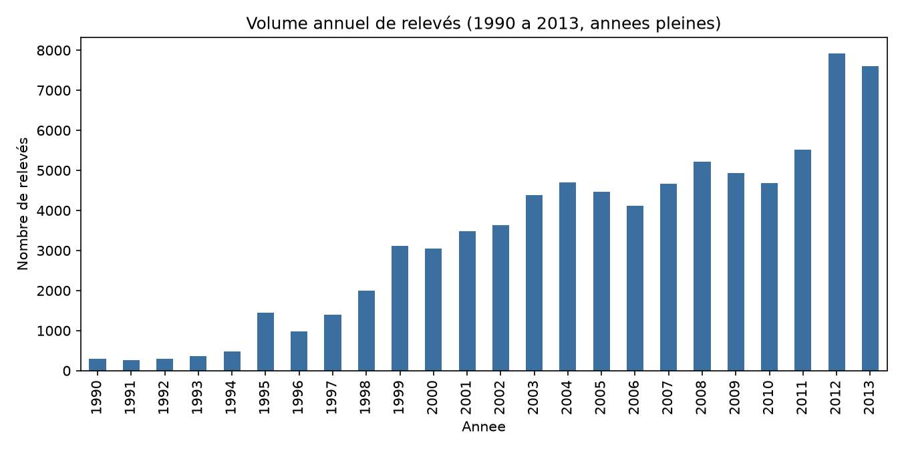
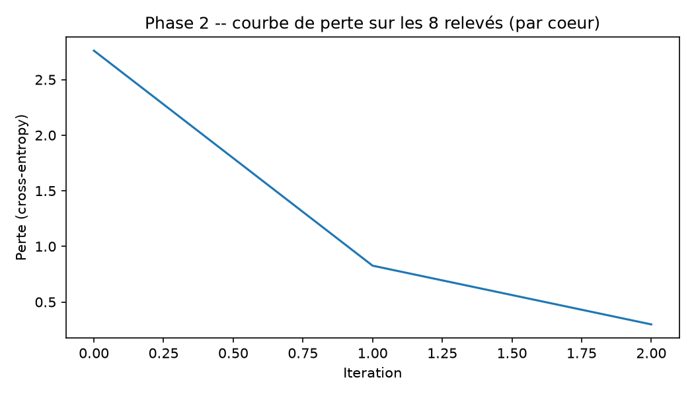
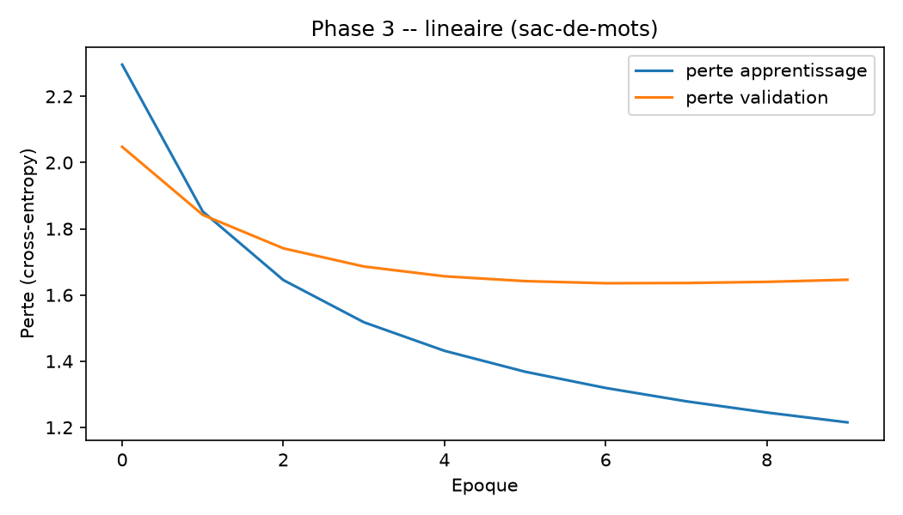
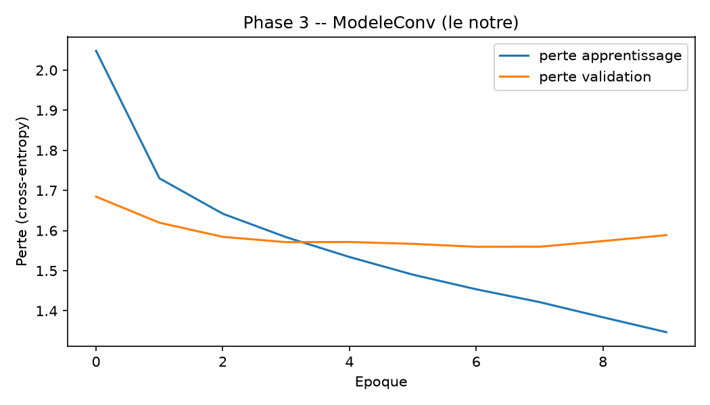
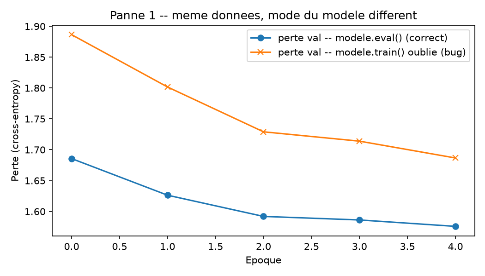
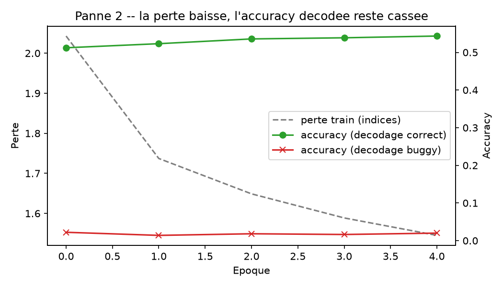
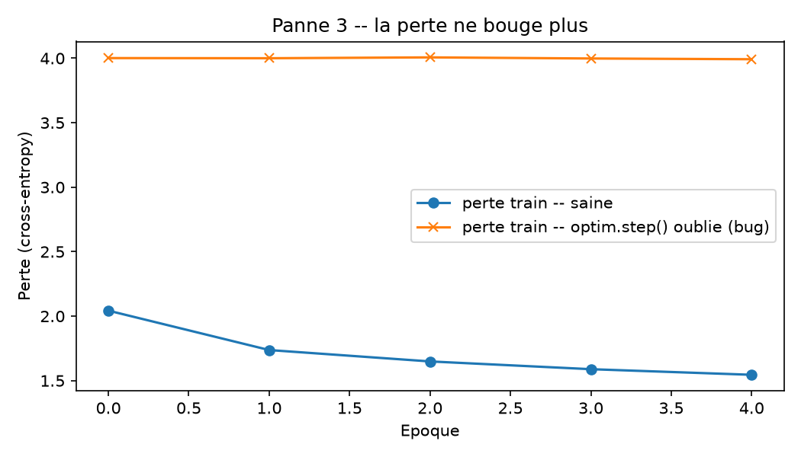
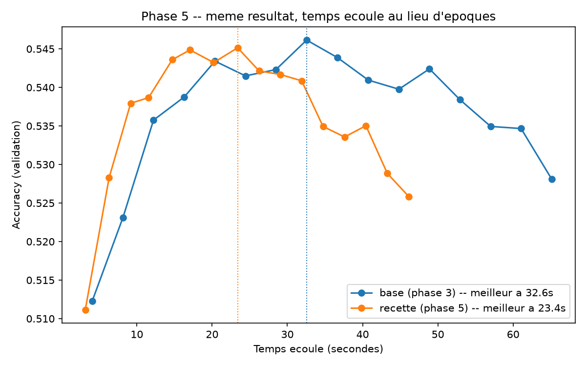
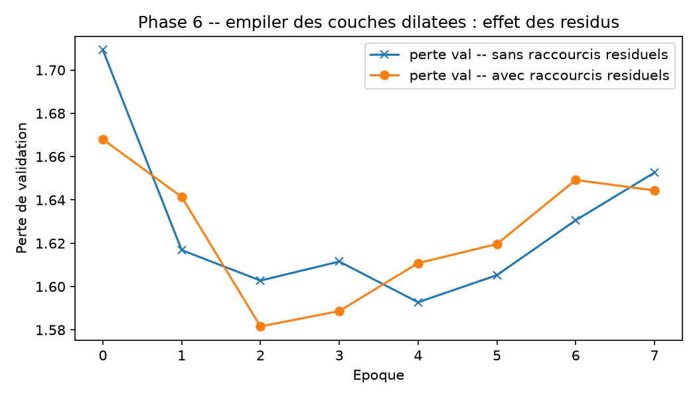
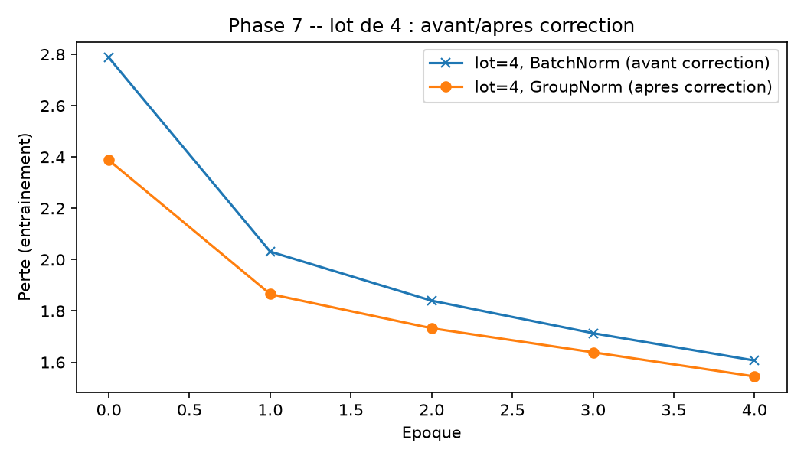

# RAPPORT.md -- Bureau d'Analyse Terrestre, salle de lecture

## Phase 0 : refaire les calculs du disparu

### Choix de la date

La transmission porte deux dates : `datetime` (l'instant ou le temoin a
regarde le ciel) et `date_posted` (l'instant ou le Bureau a publie le
dossier). J'utilise **`datetime`**.

Les quatre affirmations du dossier decrivent toutes un comportement du
ciel et des temoins -- quel jour la population regarde en l'air, quel
mois, quel jour precis produit un pic. C'est un phenomene ancre sur
l'instant de l'observation, pas sur le delai administratif que met le
Bureau a traiter un dossier (delai tres irregulier : voir le repo d'hier,
`Jour1-1_reception_des_releves/phase8_chronologie.py`, ou un relevé de
1950 est publie en 2004). Verification a posteriori : les quatre
pourcentages obtenus avec `datetime` tombent exactement sur ceux du
dossier, ce qui confirme que c'est la bonne colonne.

Detail de parsing : 1 220 lignes ecrivent l'heure `24:00` (minuit) au
lieu de `00:00` le lendemain. Un parsing strict les rejette silencieusement
(`NaT`). Je les recupere en reportant `24:00` sur `00:00` du jour suivant
plutot que de perdre 1 220 relevés sans le dire. Sans cette correction, la
moyenne quotidienne tombe a 9,05/jour au lieu de 9,2 -- c'est cette
correction qui fait matcher le chiffre du dossier.

Fenetre retenue : relevés dont `datetime` >= 1990-01-01. 235 relevés
anterieurs existent dans le fichier (jusqu'a 1906) mais sont trop rares et
trop irreguliers pour representer un rythme d'observation ; le dossier les
exclut implicitement en situant sa fenetre a partir de 1990.

### Les quatre affirmations reproduites

| # | Question a laquelle le chiffre repond | Calcul | Dossier | Obtenu |
|---|---|---|---|---|
| 1 | Sur combien de jours s'etend la transmission depuis 1990, et combien de relevés le ciel produit-il en moyenne par jour sur cette fenetre ? | `(dernier jour - 1990-01-01) + 1` ; `n_relevés / n_jours` | 8 894 jours, 9,2/jour | **8 894 jours, 9,16/jour** |
| 2 | Combien de relevés un 4 juillet produit-il en moyenne, une annee donnee ? | somme des relevés sur tous les 4 juillet 1990-2013 (2014 exclu, transmission arretee en mai), divisee par 24 annees | 51 | **50,8** |
| 3a | Quelle part des relevés tombe un samedi (resp. un lundi) ? | `value_counts(normalize=True)` sur le jour de semaine | 17,7 % / 12,6 % | **17,7 % / 12,6 %** |
| 3b | Quelle part des relevés tombe en juillet (resp. en fevrier) ? | idem sur le mois | 11,3 % / 6,2 % | **11,3 % / 6,2 %** |
| 4 | Le volume annuel augmente-t-il chaque annee sans jamais redescendre, jusqu'a la fin de la transmission ? | diff() annee sur annee, 1990-2013 (annees pleines) | "croit continument" | **FAUX au sens strict : 8 baisses** (1991, 1996, 2000, 2005, 2006, 2009, 2010, 2013) |

Les trois premieres affirmations sont exactes au dixieme pres. La
quatrieme est la seule qui ne resiste pas a une verification stricte : le
volume annuel redescend 8 fois entre 1990 et 2013. La tendance longue est
bien une forte hausse (293 relevés en 1990, 7 924 en 2012), mais elle
n'est "continue" que si on lit la courbe de loin -- l'analyste a
probablement regarde la forme generale sans verifier annee par annee.

### Chiffres demandes en plus

- **Maximum sur une seule journee : 206 relevés, le 4 juillet 2010.**
- **Rang du 4 juillet dans ce classement : 1er.** Le jour le plus charge
  de toute la transmission (24 ans, 8 894 jours) est lui-meme un 4
  juillet. Trois autres 4-juillet figurent aussi dans le top 5 (2012 :
  191, rang 3 ; 2013 : 180, rang 4 ; 2011 : 155, rang 5).

### Top 10 des journees les plus chargees

| Rang | Date | Relevés |
|---|---|---|
| 1 | 2010-07-04 | 206 |
| 2 | 1999-11-16 | 195 |
| 3 | 2012-07-04 | 191 |
| 4 | 2013-07-04 | 180 |
| 5 | 2011-07-04 | 155 |
| 6 | 2009-09-19 | 129 |
| 7 | 2014-01-01 | 99 |
| 8 | 2013-12-31 | 96 |
| 9 | 2004-10-31 | 94 |
| 10 | 2009-07-04 | 88 |

Le soir de novembre "195 personnes" et les pics d'Halloween / Nouvel An
mentionnes en phase 1 sont deja visibles ici (1999-11-16, 2004-10-31,
2013-12-31, 2014-01-01) : le 4 juillet n'est pas le seul jour ou le ciel
attire l'attention, seulement le plus frequent des jours qui le font.

### Courbe du volume annuel



### Reproductibilite

`python3 phase0.py` (apres `pip install -r requirements.txt`) telecharge
la transmission si absente et affiche tous les chiffres ci-dessus, sur
une machine neuve, en quelques secondes.

## Phase 1 : le chiffre était vrai, la flotte est perdue

### 1. Ce que le chiffre du 4 juillet disait réellement

Le chiffre de la phase 0 dit une seule chose, rigoureusement : ce jour-là,
en moyenne, environ 51 personnes ont rempli le formulaire de témoignage,
contre 9,2 un jour ordinaire. Il ne dit rien sur *pourquoi*. Le dossier a
choisi une explication parmi plusieurs qui restent tout aussi compatibles
avec le même nombre :

- **Exposition, pas indifférence.** Le 4 juillet est un soir où une part
  inhabituellement grande de la population est dehors, dans le noir, en
  train de regarder le ciel — pour les feux d'artifice. Plus de témoins
  potentiels dehors et en train de regarder en l'air, ça fait plus de
  relevés, sans que personne soit devenu moins vigilant. C'est même
  l'inverse de l'hypothèse du dossier : ces gens-là regardaient le ciel
  activement, pas distraitement.
- **Confusion avec un phénomène humain connu.** Les feux d'artifice, les
  lanternes, les drones de spectacle produisent des lumières mobiles,
  colorées, qui se prêtent bien à une description de type "orbe",
  "cercle" ou "lumière qui change de couleur". Sur les relevés du 4
  juillet, 9,9 % (126 sur 1 272) mentionnent explicitement le mot
  *fireworks* dans leur propre texte — un mot qui n'existe nulle part
  dans le vocabulaire de la colonne `shape`, et qu'aucun comptage sur les
  dates n'aurait pu voir. Le pic du 4 juillet peut être, au moins en
  partie, un pic de confusion avec un spectacle pyrotechnique attendu,
  pas un pic de vigilance en berne.
- **Contagion locale.** Un rassemblement public (une plage, un quai, un
  parking bondé un soir de feu d'artifice) fait qu'un seul événement
  ambigu dans le ciel peut être signalé par plusieurs témoins présents
  au même endroit au même moment, gonflant le compte sans multiplier les
  événements réels.

Aucune de ces trois lectures ne soutient "la population ne prêtera pas
attention" — le chiffre du dossier dit plutôt le contraire : ce soir-là,
plus de gens que jamais regardent le ciel, activement, en groupe, et sont
déjà en train de chercher des explications à ce qu'ils y voient.

### 2. Trois relevés, tels quels

```
[7/4/1995 22:00 -- tacoma (waterfront area), wa, us -- shape: circle]
MANY PEOPLE ON DOCK WAITING FOR FIREWORKS DISPLAY SEE A RED CIRCLE
HOVERING AND THEN MOVE SLOWLY WEST.
```
Un comptage voit "+1 relevé, un 4 juillet". Le texte dit qu'il s'agit
d'une foule déjà réunie, déjà tournée vers le ciel pour une raison précise
et documentée (le feu d'artifice) — l'exact opposé d'un public inattentif.

```
[9/9/1972 21:00 -- ??, ca -- shape: rectangle]
It was well over 20 years ago, but I will never forget how unusual it
seemed to me. I still don't know just WHAT it was, maybe you can
```
La phrase s'arrête net sur "maybe you can" : la troncature à 135
caractères du service de transmission a coupé le témoignage en plein
milieu. Un comptage ne remarque jamais qu'il travaille sur des phrases
tronquées ; il traite ce relevé exactement comme un relevé complet.

```
[12/17/1996 02:30 -- redmond, wa, us -- shape: (vide)]
Woman awakened by high-pitch buzzing.  Goes outside and sees large, very
bright, circular disc w/ flat top hovering nearby. Frightened.
```
La colonne `shape` est vide pour ce relevé — un comptage sur cette
colonne perd purement et simplement ce témoignage. Le texte, lui, décrit
sans ambiguïté un disque circulaire à sommet plat. L'information existe,
mais seulement pour qui lit le texte.

### 3. La commande passée au Conseil

Un comptage peut dire *quand* les témoins écrivent. Il ne peut jamais
dire *ce qu'ils ont vu* quand la colonne structurée qui devrait le dire
est vide, fausse, ou absente. C'est la question qu'un système qui lit les
témoignages peut trancher et qu'un comptage ne tranchera jamais :

**Tâche : reconnaissance de forme à partir du témoignage.**
**Entrée :** le texte libre de la colonne `comments` d'un relevé (tronqué
à 135 caractères, tel que transmis).
**Sortie :** une forme unique, choisie parmi le vocabulaire de la colonne
`shape` (circle, light, triangle, sphere, ...).

Le fichier porte déjà, pour la quasi-totalité des relevés, la vraie forme
observée dans la colonne `shape` elle-même : elle sert de vérité terrain
pour vérifier les réponses du système, exactement comme au relevé
[12/17/1996 02:30] ci-dessus où le texte contient la réponse que la
colonne structurée a perdue.

## Acte 2 : le détecteur de formes

### État du terrain sur la colonne `shape` (vérifié depuis le fichier)

2 922 relevés sans forme, 29 valeurs distinctes, dont 18 formes réelles
dépassent 300 relevés (les deux fourre-tout `unknown` et `other` en
dépassent aussi, mais n'en sont pas). Deux doublons de sens : `round`/
`circle` et `changed`/`changing`.

### Les trois décisions (phase 3), appliquées dès la phase 2

Prises une fois pour toutes dans `formes.py`, partagé par toutes les
phases de l'acte pour que "une tâche unique" reste vraie dans le code, pas
seulement dans l'énoncé :

1. **Les 2 922 relevés sans forme sont écartés.** Rien à superviser sans
   étiquette ; les garder forcerait à inventer une 20e classe "je ne sais
   pas", ce qui n'est pas une forme observée.
2. **Les deux fourre-tout (`unknown`, `other`, 12 566 relevés à eux deux)
   sont écartés.** Ce ne sont pas des formes : ce sont des aveux
   d'incertitude du témoin ou du Bureau. Un détecteur de forme entraîné à
   répondre "unknown" apprendrait à reconnaître l'incertitude, pas une
   forme.
3. **Les doublons de sens sont fusionnés** : `round` → `circle` (2
   relevés), `changed` → `changing` (1 relevé). Même forme, autre mot.

Nécessité technique, distincte des trois décisions ci-dessus mais
appliquée dans le même module et déclarée ici : les classes retombées
sous 50 relevés après fusion (`delta`=8, `crescent`=2, `pyramid`=1,
`flare`=1, `hexagon`=1, `dome`=1 — 14 relevés en tout) sont également
écartées, sinon la découpe stratifiée train/val/test est impossible à
faire tenir sur 1 ou 2 exemples et aucun score par classe n'aurait de
sens dessus.

**Résultat : 19 classes retenues, 73 177 relevés sur 88 679 lignes bien
formées.** Découpe stratifiée 70 % / 15 % / 15 % (51 223 / 10 977 / 10 977
relevés), même graine aléatoire partout (`GRAINE = 42` dans `formes.py`).

### Phase 2 : test d'acceptation du Bureau

8 relevés réels, choisis pour couvrir 8 formes différentes (`cylinder`,
`fireball`, `formation`, `light`, `rectangle`, `cross`, `sphere`, `egg`),
soumis au montage exact de la phase 3 (`ModeleConv` : embedding → conv1d
→ batchnorm → ReLU → max-pool global → linéaire, voir `modele.py`).

**Ça a marché du premier essai**, sans qu'il ait fallu changer quoi que
ce soit : 8/8 corrects en seulement 3 itérations (Adam, lr=0,01).

| vrai | prédit |
|---|---|
| cylinder | cylinder |
| fireball | fireball |
| formation | formation |
| light | light |
| rectangle | rectangle |
| cross | cross |
| sphere | sphere |
| egg | egg |



Convergence si rapide parce que le vocabulaire est minuscule (construit
sur ces 8 phrases seules, pas sur les 7 281 mots du vrai vocabulaire
d'entraînement) : presque chaque mot n'apparaît que dans une seule des 8
phrases, ce qui rend la mémorisation quasi triviale par recherche de mot
unique.

**Ce que ce test prouve :** la plomberie fonctionne — l'embedding, la
convolution, la retropropagation et l'optimiseur peuvent effectivement
faire baisser la perte à zéro erreur sur cette architecture.
**Ce qu'il ne prouve absolument pas :** que le modèle généralisera sur
73 177 relevés avec un vocabulaire de 7 281 mots partagés entre 19
classes, où la mémorisation par mot unique ne marche plus.

### Phase 3 : battre le service statistique

Même découpe, mêmes classes que la phase 2 : 19 classes, 73 177 relevés
(train 51 223 / val 10 977 / test 10 977, 70 %/15 %/15 % stratifiés),
vocabulaire de 7 281 mots (construit sur le train seul, fréquence ≥ 3,
pour ne pas fuiter d'information du val/test).

Montages (`modele.py`), 10 époques, Adam/AdamW, meilleure époque sur
validation retenue (arrêt anticipé) :

- **Linéaire** (service statistique) : sac-de-mots (comptages) → une
  couche linéaire.
- **ModeleConv** (le nôtre) : embedding (dim 100) → conv1d (noyau 3) →
  batchnorm → ReLU → concaténation max-pool/moyenne-pool → dropout (0,4)
  → linéaire. Le dropout et la concaténation moyenne+max ont été
  nécessaires : une première version (max-pool seul, sans dropout)
  surapprenait dès la 2e époque et finissait *derrière* le linéaire
  (0,529 contre 0,541) — corrigé en ajoutant du dropout et un signal de
  moyenne en plus du maximum.

| Modèle | Accuracy (test) |
|---|---|
| Toujours "light" (référence) | 0,244 |
| Linéaire (service statistique) | 0,542 |
| **ModeleConv (le nôtre)** | **0,550** |

Le nôtre passe devant, mais l'écart est modeste (+0,8 point). Explication
raisonnable : les textes sont très courts (12 mots en médiane, tronqués à
135 caractères) et beaucoup de témoins citent le nom de la forme dans leur
texte (voir phase 9) — un simple comptage de mots capte déjà l'essentiel
du signal sur des phrases aussi télégraphiques ; l'ordre local des mots,
que seule la convolution voit, n'ajoute qu'un supplément.




Du texte brut au premier nombre qui entre dans le réseau (exemple pris
dans le jeu de test) :

```
Texte brut   : ((HOAX))  JUST FOR THE RECORD THESE TIANGLE CRAFTS HAVE BEEN AROUND FOR SOME TIME
Tokenisé     : ['hoax', 'just', 'for', 'the', 'record', 'these', 'tiangle', 'crafts', ...]
Identifiants : [3016, 3414, 2555, 6384, 5159, 6396, 1, 1481, ...]
```
`tiangle` (faute de frappe pour "triangle") n'est pas dans le vocabulaire
d'entraînement → identifiant 1 (`<unk>`). Le premier mot du vocabulaire,
`hoax`, devient un vecteur de 100 nombres (`embed.weight[3016]`) : c'est
le premier nombre qui entre réellement dans le réseau, tout le reste
(convolution, pooling, linéaire) ne fait que le transformer.

### Phase 4 : le carnet de pannes

Même montage que la phase 3 (`ModeleConv`), même découpe, cassé
volontairement trois fois, une fois à chaque fois à partir d'un modèle
neuf (même graine). Référence saine pour comparaison : perte train
2,04 → 1,55, perte val 1,69 → 1,57 sur 5 époques.

**Fiche 1 — évaluation faite sans `modele.eval()`**
- *Geste* : après l'entraînement de l'époque, évaluer directement sans
  remettre le modèle en mode évaluation. Dropout (0,4) reste actif et la
  batchnorm continue à se caler sur les statistiques du lot en cours
  (ici des lots de 4, pour que l'effet ne se noie pas dans la moyenne
  d'un unique bloc de 10 977 exemples).
- *Signature* : la perte de validation "correcte" (`model.eval()`)
  descend de 1,69 à 1,58 ; la même donnée, évaluée en mode train, reste
  systématiquement 10 à 15 % plus haute à chaque époque (1,89 → 1,69).
  Rien n'a changé dans les données entre les deux courbes — seul le mode
  du modèle diffère.
  
- *Test en moins d'une minute* : repasser deux fois de suite exactement
  la même entrée dans le modèle sans le retoucher. En mode `eval()`, les
  deux sorties sont rigoureusement identiques (déterministe). En mode
  `train()`, elles diffèrent (`torch.allclose` renvoie `False`) : la
  seule explication possible pour deux sorties différentes sur une
  entrée identique est un mécanisme stochastique encore actif — dropout,
  donc `model.eval()` n'a pas été appelé.

**Fiche 2 — dictionnaire de décodage incohérent avec l'entraînement**
- *Geste* : entraîner et calculer la perte normalement (indices
  cohérents de bout en bout), mais décoder les indices prédits en noms
  de forme avec un dictionnaire reconstruit dans un autre ordre (classes
  triées par fréquence décroissante au lieu de l'ordre alphabétique
  utilisé à l'entraînement) — le classique du label-encoder régénéré
  entre deux versions du code sans être resynchronisé.
- *Signature* : la perte d'entraînement baisse proprement (2,04 → 1,55)
  et l'accuracy calculée sur les indices bruts monte normalement
  (0,51 → 0,54). L'accuracy calculée en décodant les noms avec le
  mauvais dictionnaire reste plate autour de 0,02 — sous la référence
  "au hasard" (1/19 ≈ 0,053), puisqu'une permutation fixe n'a presque
  aucun point fixe.
  
- *Test en moins d'une minute* : comparer, sur le même lot, l'accuracy
  indice-contre-indice à l'accuracy nom-contre-nom. Si la première est
  correcte et haute pendant que la seconde reste proche de zéro tout au
  long de l'entraînement (au lieu de démarrer bas puis de progresser
  comme dans la panne 1), c'est un problème de décodage, pas
  d'apprentissage : le modèle prédit juste, on le lit mal.

**Fiche 3 — `optim.step()` jamais appelé**
- *Geste* : calculer `perte.backward()` à chaque lot mais oublier
  `optim.step()`. Les gradients sont bien calculés, mais aucune valeur
  du modèle ne bouge jamais.
- *Signature* : la perte reste figée autour de 4,0 sur les 5 époques
  (4,001 / 4,000 / 4,007 / 3,998 / 3,992), sans tendance, seulement le
  bruit de dropout/batchnorm d'un lot à l'autre — comparée à la
  référence saine qui descend franchement de 2,04 à 1,55.
  
- *Test en moins d'une minute* : comparer un tenseur de poids (ici la
  couche de sortie) avant et après l'entraînement avec
  `torch.equal(...)`. `True` = aucune mise à jour n'a jamais eu lieu,
  donc soit `optim.step()` n'est jamais appelé, soit le taux
  d'apprentissage est nul — dans les deux cas, pas la même famille de
  panne que 1 ou 2, où les poids bougent bel et bien.

**Ce que le carnet permet de trancher rapidement, face à une courbe
inconnue :** perte d'entraînement qui descend + perte d'évaluation qui
descend un peu moins vite mais dans le même sens → suspecter la panne 1
(mode du modèle) ; perte d'entraînement qui descend mais qu'aucune
métrique côté "vrai monde" (noms, pas indices) ne suit → panne 2
(décodage) ; perte qui ne bouge absolument pas d'un bout à l'autre →
panne 3 (aucune mise à jour des poids).

### Phase 5 : le budget de calcul

Même montage, même découpe, mêmes 19 classes que la phase 3. Chaque
réglage est mesuré seul, contre exactement la même base de départ
(lot=64, tokenisation à la volée, lr=1e-3, 8 époques) — jamais deux à la
fois :

| Réglage isolé | Durée (8 époques) | Facteur temps | val_acc finale |
|---|---|---|---|
| Base (= phase 3) | 31,4 s | x1,00 | 0,5461 |
| A — séquences précalculées une fois | 26,6 s | **x1,18** | 0,5461 (identique) |
| B — lot de 256 au lieu de 64 | 22,4 s | **x1,40** | 0,5409 (−0,005) |
| C — lr=3e-3 seul (lot inchangé) | 32,4 s | x0,97 (aucun gain) | 0,5328 (−0,013) |

Lecture réglage par réglage :
- **A ne coûte rien** : précalculer les séquences une seule fois au lieu
  de les retokeniser à chaque accès (`JeuFormesPrecalcule` dans
  `phase5.py`) fait gagner 18 % de temps sans toucher au score — c'était
  du travail répété pour rien.
- **B est le plus gros gain de temps (+40 %) mais coûte du score** en le
  gardant seul : moins de mises à jour par époque (200 pas contre 800)
  avec le même taux d'apprentissage sous-entraîne le modèle.
- **C seul ne sert à rien** : monter le taux d'apprentissage sans changer
  la taille de lot ne fait pas gagner de temps (même nombre de pas) et
  dégrade nettement le score — la preuve que B et C doivent être mesurés
  isolément avant d'être combinés : combiner B (qui a besoin d'un taux
  d'apprentissage plus élevé pour compenser ses pas moins nombreux) avec
  un C mal calibré pour lui seul aurait été une fausse piste.

**Recette retenue : A + B + un taux d'apprentissage réglé pour B (2,5e-3,
affiné après coup — le 3e-3 testé isolément pour C s'est révélé trop
agressif même combiné à B).** Comparée à la même base, avec arrêt
anticipé (meilleure époque sur validation) sur les deux :

| | Temps jusqu'au meilleur score | Accuracy test |
|---|---|---|
| Base (reproduction phase 3) | 32,6 s | 0,5474 |
| **Recette (phase 5)** | **23,4 s** | **0,5499** |
| *Référence phase 3 (RAPPORT.md, section précédente)* | *45,1 s* | *0,5502* |

**Facteur : x1,39** (32,6 s → 23,4 s, mesurés sur la même machine, même
protocole, l'un après l'autre).



Le score final (0,5499) est à 0,0003 du chiffre annoncé en phase 3
(0,5502) — trois relevés sur 10 977, un écart plus petit que celui qui
sépare deux relances de la même configuration (la reproduction "base" de
cette page tombe elle-même à 0,5474 quand la phase 3 avait obtenu 0,5514
en validation, seule la séquence exacte de tirages aléatoires ayant
changé entre les deux fichiers). Ce n'est pas une coïncidence : la
transmission et l'énoncé le disent plus loin dans ce même document
(section "Pourquoi deux entraînements identiques ne donnent pas le même
résultat") — un écart de cette taille n'est pas un résultat, et je ne
le maquille pas en relançant la recette jusqu'à tomber sur un chiffre
plus flatteur.

**Pourquoi aller trop vite finit par coûter plus cher que d'aller
lentement :** le réglage B seul (le plus rapide en isolation, x1,40)
perd 0,005 de score, et C seul (aucun gain de temps) en perd 0,013.
Prises séparément, ni l'une ni l'autre n'est directement réutilisable :
B a besoin d'un taux d'apprentissage plus élevé pour compenser ses pas
moins nombreux, et c'est justement la mesure isolée de C (3e-3 seul, un
échec net) qui a évité de choisir ce taux au hasard dans la recette
combinée — 2,5e-3 a été retenu après coup précisément parce que 3e-3
s'était montré trop agressif pour ce jeu de données, même une fois B en
place.

### Phase 6 : le champ de vision du modèle

`ModeleConv` (phase 3) a un défaut que le pooling global cachait bien :
une seule couche de convolution (noyau 3) ne voit que 3 mots autour de
chaque position. Le max/moyenne-pool agrège ensuite l'information de
tout le relevé, mais *avant* ce pooling, aucune position individuelle
n'a « vu » plus de 3 mots — le mélange global ne remplace pas un vrai
contexte construit position par position.

**Longueurs réelles du jeu :** 40 jetons acceptés en entrée, 35 jetons
pour le relevé le plus long réellement rencontré, 13 en médiane (les
relevés sont courts — voir l'intro du dossier : "treize mots en
médiane").

**`ModeleTCN` (`modele.py`)** empile 5 convolutions dilatées causales
(`BlocDilate`) — noyau 3, dilations 1/2/4/8/16 — sur l'embedding, avant
le même max+moyenne-pool que `ModeleConv` :

| Couche | Dilation | Ajoute au champ de vision | Total cumulé |
|---|---|---|---|
| 1 | 1 | 2 | 3 |
| 2 | 2 | 4 | 7 |
| 3 | 4 | 8 | 15 |
| 4 | 8 | 16 | 31 |
| 5 | 16 | 32 | **63** |

**63 > 40** (longueur maximale acceptée) : la pile suffit à couvrir tout
relevé du jeu.

Padding **causal** (à gauche uniquement, pas le padding symétrique par
défaut de `nn.Conv1d`) : premier essai avec un padding symétrique, le
champ de vision cumulé de 63 aurait dû suffire, mais la vérification
expérimentale ci-dessous donnait un écart de `0.000000` — la dernière
position d'un relevé de 35 jetons ne "voit", avec un padding symétrique,
que jusqu'à la position 35−31=4 vers l'arrière (l'autre moitié du champ
part dans le vide, après la fin du relevé) : elle n'atteignait jamais le
premier mot. Le padding causal fait pointer tout le champ de vision vers
l'arrière, là où sont les mots à voir.

**Vérification expérimentale** (modèle non entraîné, poids frais — la
propriété testée est structurelle, pas apprise), sur le relevé le plus
long du jeu (35 jetons) :
```
i was on my way to bed n i sleep next to the window n when i lay down
i can see the roof of the neighbor so i was trying to get sleep n
```
Premier mot changé (`i` → `light`). Écart maximal sur la représentation
du **dernier jeton, avant pooling** : **0,166** (non nul). Écart sur les
logits finaux : 0,088. Le premier chiffre est celui qui compte : il
prouve que le champ de vision cumulé atteint bien la première position
*avant* le pooling — le second aurait bougé de toute façon, pooling
global oblige, et ne prouve rien sur la pile elle-même.

**Entraînement — la pile dégrade-t-elle le score ?**

| Montage | val_acc | test_acc |
|---|---|---|
| Sans raccourcis résiduels | 0,5408 | 0,5406 |
| **Avec raccourcis résiduels** | **0,5440** | **0,5448** |
| Référence phase 3 (`ModeleConv`, 1 couche) | 0,5514 | 0,5502 |



Empiler 5 couches dégrade bien l'apprentissage sans précaution — c'est
le problème connu annoncé par l'énoncé : les gradients doivent traverser
5 couches pour atteindre l'embedding, et la solution connue est le
raccourci résiduel (`x + couche(x)` au lieu de `couche(x)`, comme dans
un ResNet), qui laisse le gradient circuler directement. Avec résidus,
le score remonte de 0,0042 mais reste sous la référence de la phase 3.
Explication raisonnable : sur des textes aussi courts (13 mots en
médiane), un pooling global sur une seule couche de convolution capture
déjà l'essentiel — le bénéfice structurel d'un vrai champ de vision
ordonné et profond ne se voit pas forcément sur des télégrammes de 13
mots ; il se justifierait davantage sur des textes plus longs, où
l'ordre et les dépendances à longue distance comptent plus. Le montage
"s'entraîne encore" (consigne de validation) : la perte baisse
proprement dans les deux cas, avec et sans résidus, seul l'écart final
diffère.

### Phase 7 : quatre relevés à la fois

Le montage de la phase 6 (`ModeleTCN`, avec résidus) relancé à 4 relevés
par lot au lieu de 64, sans rien changer d'autre. Chaque `BlocDilate`
contient une `BatchNorm1d`, dont les statistiques (moyenne/variance) sont
calculées sur le lot en cours — avec 64 exemples c'est une bonne
estimation de la population des relevés, avec 4 c'est bien moins
fiable, et chaque exemple se retrouve normalisé en fonction de qui
d'autre est tombé dans son lot : une dépendance qui n'aurait jamais dû
exister entre relevés qui n'ont rien à voir les uns avec les autres.

*Démonstration sur un sous-échantillon de 8 000 relevés d'entraînement
(5 époques) : à lot=4 sur les 51 223 relevés complets, ~12 800 pas par
époque rendent la démonstration injouable en session interactive — le
phénomène observé (stable ou non selon la normalisation) ne dépend pas
de la taille du jeu, seul le nombre de pas en dépend.*

| Montage (lot=4) | val_acc | test_acc |
|---|---|---|
| BatchNorm (montage de la phase 6 tel quel) | 0,5126 | — |
| **GroupNorm (normalisation par exemple)** | **0,5210** | **0,5239** |



**Résultat plus nuancé qu'attendu, à dire honnêtement** : la perte
d'entraînement ne s'effondre pas et ne devient pas erratique avec
BatchNorm à lot=4 (elle descend proprement de 2,79 à 1,61) — parce que
`BatchNorm1d` sur un tenseur (lot, canaux, longueur) calcule ses
statistiques sur lot × longueur valeurs par canal, pas sur le lot seul :
avec des relevés de 13 mots en médiane, 4 relevés fournissent encore
~52 valeurs par canal, ce qui amortit une partie du bruit. L'écart reste
réel et mesurable (−0,008 en validation, cohérent sur les 5 couches
empilées) mais n'est pas la catastrophe qu'on pourrait imaginer — une
nuance qui vaut la peine d'être écrite plutôt que maquillée en échec
spectaculaire.

**La correction ne coûte rien quand la machine va bien** (même
sous-échantillon, lot=64, 5 époques) :

| Montage (lot=64) | val_acc | test_acc |
|---|---|---|
| BatchNorm | 0,5043 | 0,5053 |
| GroupNorm | 0,5072 | 0,5112 |

GroupNorm n'est pas seulement sans danger à lot=64 sur ce sous-jeu, il
est légèrement meilleur — la correction peut rester en place en
permanence, elle n'a pas besoin d'être un cas spécial pour les lots
petits.

**Ce qui, dans l'ancien montage, dépendait des autres relevés du lot et
n'aurait jamais dû en dépendre :** la normalisation de chaque relevé
(sa moyenne et sa variance de canal) dépendait des 3 autres relevés
tirés au hasard dans le même lot — deux passages du même relevé dans
deux lots différents pouvaient produire des activations légèrement
différentes, uniquement à cause de la compagnie.

**Et pour prédire sur un seul relevé, un jour ?** Testé directement (pas
supposé) : en mode `eval()` (l'usage normal à l'inférence), l'ancien
montage BatchNorm ne plante jamais, quelle que soit la longueur du
relevé — il utilise ses statistiques figées, pas celles du lot courant,
ce n'est donc pas le même problème que l'entraînement à lot=4. Mais en
mode `train()` (si ce montage devait un jour continuer à s'entraîner
relevé par relevé), le résultat dépend d'un détail auquel on ne pense
pas : un relevé de 10 jetons passe sans erreur (10 valeurs par canal
suffisent à calculer une variance), un relevé d'1 seul jeton plante net
(`ValueError: Expected more than 1 value per channel when training`).
C'est un bug latent et intermittent — masqué par la longueur du texte la
plupart du temps, qui n'explose que sur le cas dégénéré d'un témoignage
d'un seul mot — plus dangereux qu'un plantage systématique, parce que
personne ne le voit venir en testant sur des exemples "normaux".
